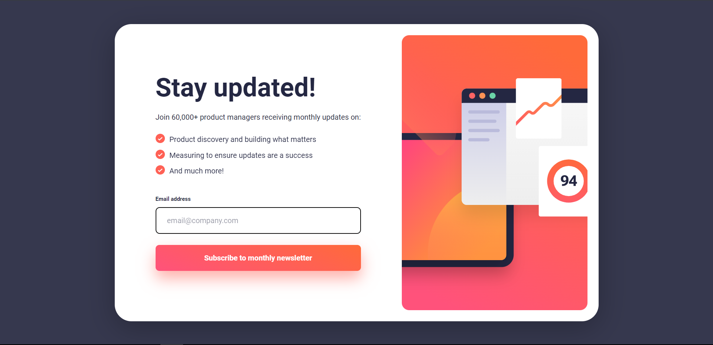

# Frontend Mentor - Newsletter sign-up form with success message solution

This is a solution to the [Newsletter sign-up form with success message challenge on Frontend Mentor](https://www.frontendmentor.io/challenges/newsletter-signup-form-with-success-message-3FC1AZbNrv). Frontend Mentor challenges help you improve your coding skills by building realistic projects.

## Table of contents

- [Overview](#overview)
  - [The challenge](#the-challenge)
  - [Screenshot](#screenshot)
  - [Links](#links)
- [My process](#my-process)
  - [Built with](#built-with)
  - [What I learned](#what-i-learned)
- [Author](#author)

## Overview

### The challenge

Users should be able to:

- Add their email and submit the form
- See a success message with their email after successfully submitting the form
- See form validation messages if:
  - The field is left empty
  - The email address is not formatted correctly
- View the optimal layout for the interface depending on their device's screen size
- See hover and focus states for all interactive elements on the page

### Screenshot

#### Desktop

#### Active States

#### Error State

#### Success State

#### Mobile

### Links

- Solution URL: [GitHub](https://github.com/Ibtehaj-Ali-1/Newsletter-sign-up-form)
- Live Site URL: [Newsletter Sign-up Form](https://newsletter-sign-up-form-self.vercel.app/)

## My process

### Built with

- Semantic HTML5 markup
- CSS custom properties
- Flexbox
- CSS Grid
- Mobile-first workflow
- JavaScript for form validation

### What I learned

- How to create a responsive form with CSS Grid and Flexbox
- How to use JavaScript to validate form inputs
- How to create a success and error message using JavaScript
- How to use CSS custom properties to make the code more readable and maintainable

## Author

- Website - [Ibtehaj Ali Mirza](https://github.com/Ibtehaj-Ali-1)
- Frontend Mentor - [@Ibtehaj-Ali-1](https://www.frontendmentor.io/profile/Ibtehaj-Ali-1)
